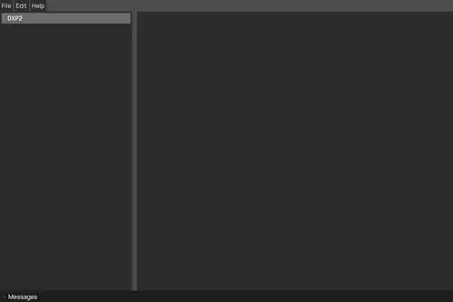

# DoW Mod Editor

A modern file browser and editor for Warhammer 40,000: Dawn of War mods.  
You can see it as an improved Corsix Mod Studio.  

⭐️ *If you find this tool useful, please consider starring this repository!*

[Features](#features) • [Installation](#installation) • [Usage](#usage) • [Building](#building-from-source) • [Troubleshooting](#troubleshooting)

-----




## Features

  * **Core Operations:** Browse, view, unpack, and edit mod files directly.
  * **Lua-based Editing:** Open `.rgd` and `.whe` files as Lua code. This enables standard text editor workflows like diffing, text search, and commenting out sections.
  * **Media Previews:** View images and 3D models natively within the editor without external tools.
  * **Blender Integration:** Quickly push and open files directly into Blender.
  * **Multi-Mod Support:** Open multiple mods simultaneously and quickly switch between them.
  * **Chunky Viewer:** Integrated viewer designed to browse chunk hierarchy, headers, and specific contents.
  * **Highly Customizable:** Mod the mod editor with the mod editor! Easily configure fonts, text sizes, icons, colors, and key bindings to fit your workflow.

## Installation

Download the standalone archive for your operating system from the [latest release](https://github.com:amorgun/dow_mod_editor/releases/latest). No complex setup required.

## Usage

1.  Extract the downloaded archive.
2.  Run the executable.
3.  Click **File -> Open Mod** and select a `.module` file.

## Building from Source

If you want to build the editor yourself, simply clone the repository and use the provided Makefiles:

```bash
git clone git@github.com:amorgun/dow_mod_editor.git
cd dow_mod_editor

# For Linux:
make linux

# For Windows:
make windows
```

## Troubleshooting

If you encounter a crash, a visual bug, or a file failing to load, you can inspect the application logs directly from the UI:
  * Click **Help -> Logs** to view detailed runtime information.
